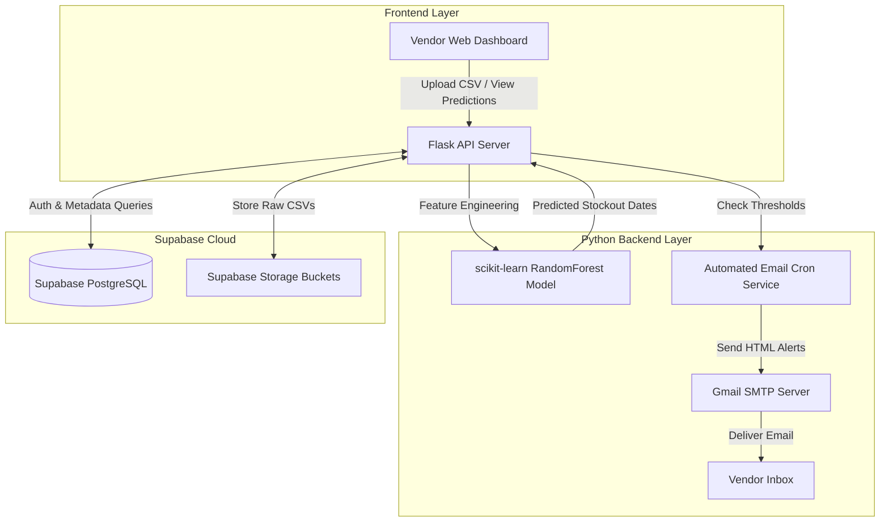

<div align="center">

# 🤖 VendAI: AI-Powered Smart Vending Machine
### *Predictive Inventory Management & Automated Stockout Alert System*

[](https://www.python.org/)
[](https://flask.palletsprojects.com/)
[](https://scikit-learn.org/)
[](https://supabase.com/)
[](https://vendai-app.onrender.com)
[](LICENSE)

*A 100% software-based, hardware-free intelligent demand forecasting platform designed to eliminate stockouts in high-priority campus vending machines.*

🌐 **Live Application**: [https://vendai-app.onrender.com](https://vendai-app.onrender.com)

---

</div>

## 📌 Executive Overview

**VendAI** is an end-to-end intelligent inventory management web platform built to solve stockouts in campus vending machines without requiring costly IoT hardware or sensors. The system specifically addresses the unique restocking needs of vending machines that houses both critical individual welfare items (sanitary pads, tampons, first-aid/medications) and daily consumables (chocolates, snacks, beverages).

By leveraging a **Random Forest Regressor** model trained on historical usage patterns, **VendAI** predicts exact per-product depletion dates, displays stock health on a dynamic calendar view, and dispatches automated dual-threshold email alerts to operators before critical items run dry.

🚀 **Live Deployment**: Access the live web application directly at **[https://vendai-app.onrender.com](https://vendai-app.onrender.com)**

---

## 🎯 Problem Statement & Impact

| Traditional Vending Challenges | VendAI Solution |
| :--- | :--- |
| ❌ Reactive restocking leads to depleted sanitary & medicinal stock during emergencies. | ✅ **Predictive AI alerts** notify vendors days before stock reaches 50% & 80% depletion. |
| ❌ High costs for IoT sensors, weight plates, and telemetry hardware. | ✅ **100% Hardware-Free & Zero Cost** software platform utilizing open-source ML. |
| ❌ Unpredictable demand surges during exams, events, or weather shifts. | ✅ **Machine Learning Model** factors in day-of-week, seasonality, and historical velocity. |
| ❌ Inefficient vendor trips to well-stocked machines wasting time & fuel. | ✅ **Color-coded calendar dashboard** giving instant visual inventory health. |

---

## ✨ Key Features

- 📊 **Historical CSV Data Ingestion & Auto-Detection**: Upload raw sales and inventory logs; VendAI automatically parses product categories, initial quantities, and historical consumption rates.
- 🌲 **Machine Learning Prediction Engine**: Powered by `scikit-learn`'s `RandomForestRegressor` to analyze multi-variable demand dynamics (day-of-week trends, month seasonality, stock depletion rates).
- 📅 **Dynamic Color-Coded Calendar Dashboard**: Visually tracks product stock health per machine with intuitive indicator thresholds:
  - 🟢 **Green (Healthy)**: Stock > 50%
  - 🟡 **Yellow (Warning)**: Stock depleted by 50% – 79%
  - 🔴 **Red / Black (Critical)**: Stock depleted ≥ 80% or out of stock
- 📧 **Automated Dual-Threshold Email Alerts**: Background cron tasks evaluate stock predictions daily and send HTML email notifications via Gmail SMTP when items pass key thresholds.
- 🚀 **Cold-Start Onboarding Flow**: Allows new vendors without historical data to manually initialize machine inventory baseline.
- 📈 **Consumption Insights & Analytics**: Highlights top and bottom-performing SKUs, seasonal spikes, and recommended restocking priorities.
- 🔒 **Secure Auth & Row-Level Security**: Integrated with Supabase Auth (JWT) and PostgreSQL Row Level Security (RLS) to isolate multi-tenant vendor datasets.

---

## 🏗️ Architecture & Data Flow



---

## 🛠️ Technology Stack

| Layer | Technology | Purpose |
| :--- | :--- | :--- |
| **Backend Framework** | Python 3.10+, Flask / Gunicorn | REST API routes, ML model orchestration, background tasks |
| **Machine Learning** | scikit-learn, pandas, numpy | RandomForestRegressor model, feature engineering & data processing |
| **Database & Auth** | Supabase (PostgreSQL), Supabase Auth | User authentication, RLS policy enforcement, database storage |
| **Storage** | Supabase Storage Buckets | Secure storage of uploaded CSV & Excel dataset files |
| **Alert System** | Python `smtplib` + Gmail SMTP | HTML formatted automated stock alert emails |
| **Deployment** | Render / PythonAnywhere | Cloud web hosting and continuous deployment via `render.yaml` & `Procfile` |

---

## 📁 Repository Directory Structure

```text
VendAI/
├── .env.example                                  # Template for environment configuration keys
├── .gitignore                                    # Git exclusion patterns
├── FINAL_PRD_AI_Smart_Vending_Machine.md          # Comprehensive Product Requirements Document
├── FINAL_TDR_AI_Smart_Vending_Machine.md          # Detailed Technical Design Requirement Document
├── Machine_1_CityMall_inventory_Jan_Apr_2026.csv   # Sample inventory dataset for testing/training
├── Procfile                                      # Process file for web server deployment (Gunicorn)
├── render.yaml                                   # Render deployment infrastructure configuration
├── start.sh                                      # Execution script for web startup
├── check_db.py                                   # Helper script for database verification
├── test_api.py                                   # API endpoint test suite
├── test_supabase.py                              # Supabase database connectivity tester
├── backend/                                      # Flask API application source code
│   ├── app.py                                    # Flask application entrypoint & API routes
│   ├── check_machines.py                         # Machine inspection script
│   ├── requirements.txt                          # Python dependencies list
│   ├── supabase_client.py                        # Supabase client initializer & helpers
│   ├── test_alert.py                             # Email notification test harness
│   ├── email_templates/                          # HTML email templates for alerts
│   ├── models/                                   # ML model training logic & model persistence
│   ├── routes/                                   # Modular API route controllers
│   └── utils/                                    # Utility helpers for data parsing & date math
├── database/                                     # Database schema definitions & SQL migrations
└── frontend/                                     # User Interface files & dynamic dashboard components
```

---

## ⚡ Quick Start & Local Setup

### Prerequisites
- **Python 3.10+** installed on your system.
- **Git** installed.
- A **Supabase** account (Free Tier).
- A **Gmail** account with an App Password generated for SMTP email delivery.

### 1. Clone the Repository
```bash
git clone https://github.com/Anishsingh14/VendAI.git
cd VendAI
```

### 2. Set Up Virtual Environment & Dependencies
```bash
# Create virtual environment
python -m venv venv

# Activate virtual environment
# On Windows:
venv\Scripts\activate
# On macOS/Linux:
source venv/bin/activate

# Install backend dependencies
pip install -r backend/requirements.txt
```

### 3. Configure Environment Variables
Copy `.env.example` to `.env` in the root directory:
```bash
cp .env.example .env
```

Fill in your service configuration keys in `.env`:
```env
SUPABASE_URL=https://your-supabase-project.supabase.co
SUPABASE_KEY=your-supabase-anon-or-service-key
SMTP_EMAIL=your-gmail-address@gmail.com
SMTP_PASSWORD=your-gmail-app-password
SECRET_KEY=your-flask-secret-key
```

### 4. Run Database & Supabase Verification
Verify that your database connection is active:
```bash
python test_supabase.py
```

### 5. Start Backend Server
```bash
python backend/app.py
```
The Flask development server will start at `http://localhost:5000`.

---

## 📡 API Reference Overview

| HTTP Method | Endpoint | Description |
| :--- | :--- | :--- |
| `POST` | `/api/auth/signup` | Register a new vendor account |
| `POST` | `/api/auth/login` | Authenticate vendor & return JWT token |
| `GET` | `/api/machines` | List all vending machines owned by vendor |
| `POST` | `/api/machines` | Add a new vending machine location |
| `POST` | `/api/inventory/upload` | Upload CSV inventory dataset for ML training |
| `GET` | `/api/predictions/<machine_id>` | Fetch predicted stock depletion & calendar data |
| `POST` | `/api/alerts/test` | Trigger a sample email alert test |

---

## 🧠 Machine Learning Engine Architecture

The core prediction model operates in three distinct phases:

1. **Feature Engineering**:
   - `DayOfWeek` (0 = Monday, 6 = Sunday)
   - `Month` & `IsWeekend` flags
   - `RollingDepletionRate` (units consumed per day over trailing 7/14/30 days)
   - `SpecialEventFlag` (exam periods, campus holidays)
2. **Model Training**:
   - Trains a `RandomForestRegressor` (`n_estimators=100`, `random_state=42`) per product SKU.
   - Outputs predicted daily sales velocity.
3. **Stockout Date Calculation**:
   - $\text{Days to Stockout} = \frac{\text{Current Inventory}}{\text{Predicted Daily Velocity}}$
   - Maps stockout date directly to calendar health buckets (Green, Yellow, Red/Black).

---

## 🚢 Deployment Guide

This project includes pre-configured deployment manifests for cloud hosting on **Render**:

1. Connect your GitHub repository `Anishsingh14/VendAI` to **Render**.
2. Select **Blueprint** deployment mode.
3. Render will auto-detect `render.yaml` and configure:
   - Web Service command: `./start.sh` or `gunicorn backend.app:app`
   - Build command: `pip install -r backend/requirements.txt`
4. Add your Environment Variables in the Render Dashboard (`SUPABASE_URL`, `SUPABASE_KEY`, `SMTP_EMAIL`, `SMTP_PASSWORD`).

---

## 🤝 Contributing

Contributions are welcome! Please read [`CONTRIBUTING.md`](CONTRIBUTING.md) for details on code style, commit conventions, and the process for submitting pull requests.

---

## 📜 License

This project is licensed under the **MIT License** - see the [`LICENSE`](LICENSE) file for details.

---

## 👨‍💻 Author & Acknowledgments

- **Author**: Anish Singh
- **GitHub**: [@Anishsingh14](https://github.com/Anishsingh14)
- **Project Scope**: Built as a zero-cost intelligent campus solution for vending machine inventory optimization.
